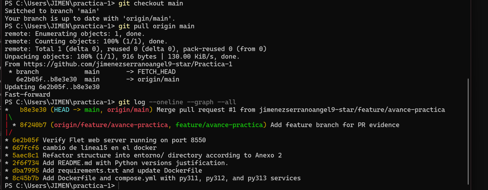
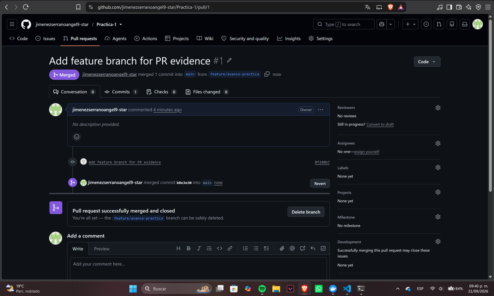
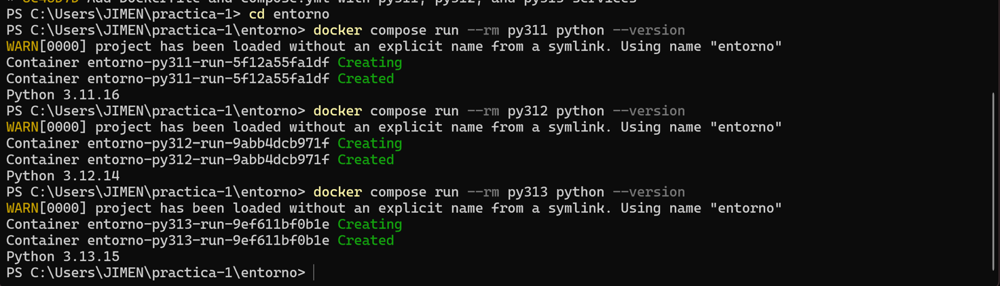

# Ejercicio 1: Configuración del Entorno de Trabajo (Git y Docker)

## Datos del Alumno
* **Nombre completo:** Jimenez Serrano Angel Gabriel
* **Boleta:** 2025630215
* **Grupo:** 4CV4
* **Carrera:** Ingeniería en Sistemas Computacionales
* **Materia:** Teoría de la Computación
* **Profesor:** Gabriel Hurtado Avilés

---

## Parte A: Cuestionario Conceptual

### 1. ¿Qué es un sistema de control de versiones y qué problema resuelve en un trabajo en equipo?
Es una herramienta de software que registra y gestiona los cambios realizados en archivos a lo largo del tiempo, creando un historial de revisiones que permite recuperar versiones anteriores y comparar modificaciones. Este sistema actúa como una red de seguridad que protege el código fuente y otros activos digitales de daños irreparables o pérdida accidental.

### 2. ¿Cuál es la diferencia entre Git y GitHub?
* **Git:** Funciona como el motor subyacente; permite crear, fusionar y revisar ramas, así como mantener un historial de cambios sin necesidad de conexión a internet.
* **GitHub:** Actúa como un repositorio remoto accesible desde cualquier lugar, ofreciendo herramientas adicionales como pull requests, seguimiento de incidencias (*issues*), gestión de proyectos y automatización de flujos de trabajo.

### 3. Definición de conceptos clave

* **Repositorio:** Carpeta donde se guarda el proyecto y su historial (ejemplo: un repositorio hosted en GitHub).
* **Confirmación (*commit*):** Fotografía del estado del proyecto en un momento dado para marcar cambios (ej. `git commit -m "feat: agregar login"`).
* **Rama (*branch*):** Espacio independiente que permite trabajar en el proyecto sin modificar la versión funcional principal (ej. `feature/conexion-bd`).
* **Fusión (*merge*):** Proceso de unir dos o más ramas para integrar las modificaciones y el historial de commits de una rama secundaria.
  * *Ejemplo de salida de consola:*
    ```text
    Updating 7f3a92b..a1b2c3d
    Fast-forward
     login.php | 25 +++++++++++++++++++++++++
     1 file changed, 25 insertions(+)
     create mode 100644 login.php
    ```
* **Conflicto de fusión:** Ocurre cuando Git no puede combinar dos ramas automáticamente por modificaciones encontradas en las mismas líneas de código.
  * *Ejemplo de salida de conflicto:*
    ```text
    AUTO-MERGING main.cpp
    CONFLICT (content): Merge conflict in main.cpp
    Automatic merge failed; fix conflicts and then commit the result.
    ```
* **Pull Request (PR):** Petición formal enviada a los administradores de un repositorio para solicitar la revisión e integración de código desde una rama secundaria hacia la rama principal.
* **Archivo `.gitignore`:** Archivo de texto plano en la raíz del proyecto que indica a Git qué archivos o directorios no deben ser rastreados ni subidos al repositorio.
* **Archivo `README.md`:** Archivo en formato Markdown ubicado en la raíz que presenta la documentación, descripción e instrucciones generales del proyecto.

### 4. ¿Qué es un contenedor y en qué se diferencia de una máquina virtual?
Un **contenedor** es una unidad de software ligera que encapsula una aplicación y sus dependencias, ejecutándose sobre el kernel del sistema operativo host en lugar de emular hardware completo.

* **Arranque:** Los contenedores inician en segundos o milisegundos; las Máquinas Virtuales (VM) tardan minutos por inicializar un SO completo.
* **Tamaño:** Los contenedores pesan megabytes (MB); las VM pesan gigabytes (GB) por incluir su propio SO e imágenes pesadas.
* **Aislamiento:** Las VM ofrecen aislamiento completo a nivel de hardware; los contenedores brindan aislamiento a nivel de proceso/sistema operativo (cgroups/namespaces).

### 5. Conceptos clave de Docker

* **Imagen:** Plantilla inmutable que contiene el código, dependencias y configuraciones necesarias para ejecutar una aplicación.
* **Contenedor:** Instancia mutable en ejecución de una imagen que opera como un proceso aislado.
* **Volumen:** Mecanismo de almacenamiento persistente externo al ciclo de vida del contenedor.
* **Puerto publicado:** Mapeo de un puerto del host a un puerto interno del contenedor (`puerto_host:puerto_contenedor`).

### 6. Entornos virtuales en Python
Un **entorno virtual** es un directorio aislado con su propia copia del ejecutable de Python y paquetes instalados. No modifica la versión global del intérprete porque utiliza enlaces o copias locales y modifica variables de entorno (como `PATH`) durante su activación.

### 7. Fijación de versiones de imágenes Docker
Fijar la versión como `python:3.12-slim` en lugar de `python:latest` garantiza la reproducibilidad, estabilidad e inmutabilidad de los entornos de desarrollo y producción evitando cambios inesperados en futuras actualizaciones.

---

## Parte B: Configuración del Repositorio y Evidencias de Git

1. **Creación del Repositorio y README:** Se inicializó el repositorio con los datos del alumno y la estructura de índice requerida.
2. **Archivo `.gitignore` Configurado:** Excluye entornos virtuales (`venv/`), archivos compilados (`__pycache__/`, `*.pyc`) y temporales, manteniendo rastreados los archivos `.jff` de JFLAP.
3. **Historial de Commits:** Se generaron confirmaciones frecuentes con mensajes descriptivos sobre el avance de la práctica.
4. **Flujo de Trabajo con Ramas:** Se creó la rama `feature/avance-practica`, se generó un Pull Request y se fusionó a `main`.

---

## Parte C: Entregables del Ejercicio 1

* **URL del Repositorio Remoto:**  
  `https://github.com/jimenezserranoangel9-star/Practica-1`

### Evidencia de `git log`
Visualización del árbol de historial y fusiones de ramas:


### Evidencia del Pull Request Fusionado
Captura del PR en GitHub con la cinta indicadora de estado **Merged**:


### Evidencia de Entorno Multicontenedor (Docker)
Ejecución de verificación de versión para Python 3.11, 3.12 y 3.13 sobre contenedores Docker:
