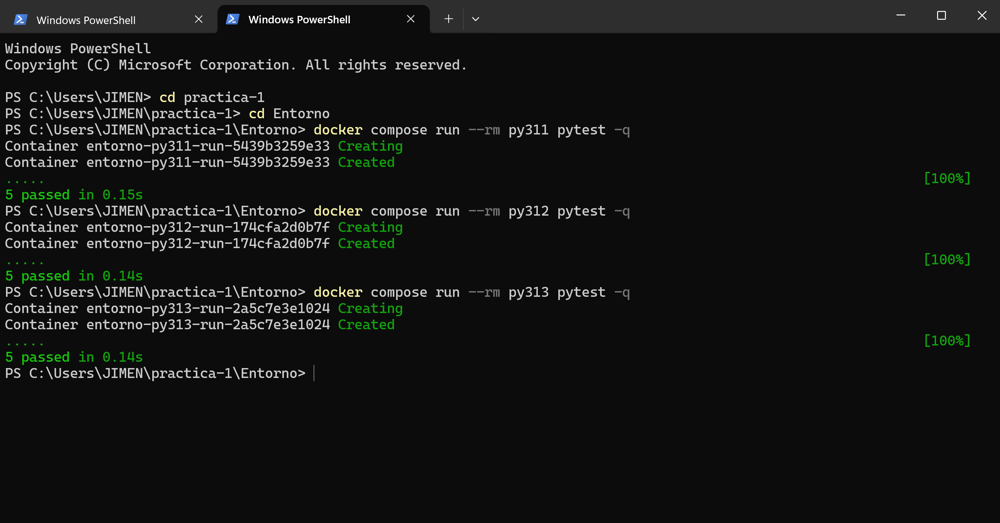

# Ejercicio 5: Aplicación Web y Pruebas de Software

## 1. Código Fuente Versionado

El proyecto está dividido formalmente en dos capas independientes: la lógica de negocios del lenguaje (`src/lenguajes.py`) y la interfaz de usuario web (`src/app.py`).

### 1.1 Núcleo Formal (`src/lenguajes.py`)

```python
"""
Módulo del núcleo para operaciones formales sobre cadenas, lenguajes y alfabetos.
"""

def obtener_prefijos(cadena: str) -> list[str]:
    return [cadena[:i] for i in range(len(cadena) + 1)]

def obtener_sufijos(cadena: str) -> list[str]:
    return [cadena[i:] for i in range(len(cadena) + 1)]

def obtener_subcadenas(cadena: str) -> list[str]:
    subcadenas = set()
    n = len(cadena)
    for i in range(n + 1):
        for j in range(i, n + 1):
            subcadenas.add(cadena[i:j])
    return sorted(list(subcadenas), key=lambda x: (len(x), x))

def generar_cerradura_kleene(alfabeto: set[str], n_max: int) -> list[str]:
    if n_max < 0:
        return []
    if len(alfabeto) > 1 and n_max > 8:
        estimacion = sum(len(alfabeto) ** i for i in range(n_max + 1))
        if estimacion > 200000:
            raise ValueError(f"La cantidad estimada ({estimacion}) excede el límite permitido.")

    resultado = [""]
    actuales = [""]
    for _ in range(n_max):
        siguientes = []
        for c in actuales:
            for simbolo in sorted(list(alfabeto)):
                siguientes.append(c + simbolo)
        resultado.extend(siguientes)
        actuales = siguientes
    return resultado

def generar_cerradura_positiva(alfabeto: set[str], n_max: int) -> list[str]:
    kleene = generar_cerradura_kleene(alfabeto, n_max)
    return [w for w in kleene if w != ""]
```  
### 1.2 Capturas de la interfaz y su funcionamiento
 
 
 
## 2. Salidas de la Suite de Pruebas (PyTest)

### 2.1 Salida Python 3.11 (`py311`), Python 3.12 (`py312`) y Python 3.13 (`py313`).


## 3. Tabla comparativa de versiones
| Servicio Docker | Versión de Python | Comando Ejecutado | Pruebas Totales | Pruebas Exitosas | Tiempo Total |
| :--- | :--- | :--- | :---: | :---: | :---: |
| `py311` | Python 3.11 | `docker compose run --rm py311 pytest -q` | 5 | 5 | 0.15s |
| `py312` | Python 3.12 | `docker compose run --rm py312 pytest -q` | 5 | 5 | 0.14s |
| `py313` | Python 3.13 | `docker compose run --rm py313 pytest -q` | 5 | 5 | 0.14s |